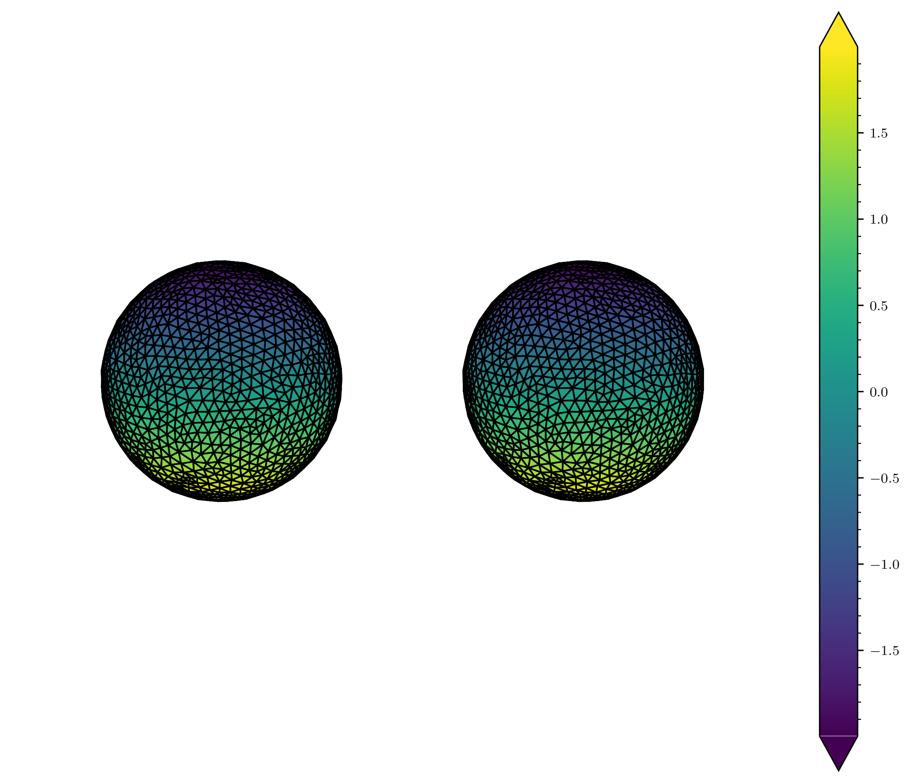

# Surface Laplacian

A Python implementation of surface laplacian of triangle meshes. Notably, passing arbitrary weight functions can compute stiffness and mass matrices. In ```operators.py```, the three estimations published by [Huiskamp 1991](https://doi.org/10.1016/0021-9991(91)90286-T) and the classic [cotangent formula](https://www.cs.cmu.edu/~kmcrane/Projects/Other/nDCotanFormula.pdf) are implemented.

## Usage

```python
from half_edge import HalfEdgeModel
from surface_laplacian import SurfaceLaplacian, operators

vertices = # numpy.ndarray [float32] or open3d.utility.Vector3dVector
triangles = # numpy.ndarray [int32] or open3d.utility.Vector3iVector

model = HalfEdgeModel(vertices, triangles)
sl = SurfaceLaplacian(model)

cot_matrix = sl.stiffness(operators.cotan)
```

Alternativaly, you can use ```operators.rard```, ```operators.raid``` and ```operators.iaid```,

```python
mass_matrix = sl.mass(operators.bary)
```
or ```operators.voro```, ```operators.mixed``` for barycentric, Voronoi or mixed Voronoi regions in the mass matrix.

## Example

Let $f(\phi) = \cos(\phi)$, therefore $\nabla^2 f(\phi) = -2 f(\phi)$. The discrete Laplacian matrix  $L=M^{-1}S$ is used to estimate $\nabla^2 f(\phi)$ trough $Lf_i$ on a unitary sphere,



where top sphere is evaluated on $-2 f(\phi)$ and bottom on  $Lf_i$.